# NestNotes Flat Sharing Platform

NestNotes is a full-stack flat sharing and rental platform that helps users find flats, connect with owners, express interest in properties, manage favorites, and communicate through an integrated messaging system.

## Version

Current Release: v1.0

## Features

### Authentication
- User Registration
- User Login
- JWT Authentication
- Protected Routes

### Listings
- Create Listings
- Edit Listings
- Delete Listings
- View Listing Details
- Image Uploads using Multer
- Listing Verification System

### User Features
- User Profiles
- Favorites System
- Interest Management
- View Interested Users
- Dashboard Statistics

### Messaging
- Direct Messaging
- Owner Inbox
- Reply System
- Chat Interface

### Search & Discovery
- Search Listings
- Filter Listings
- Sort Listings by Rent

### Admin Features
- Verify Listings
- Manage Platform Content

## Tech Stack

### Frontend
- HTML5
- CSS3
- JavaScript (ES6)

### Backend
- Node.js
- Express.js

### Database
- SQLite

### Authentication
- JWT
- bcryptjs

### File Uploads
- Multer

### Testing
- Jest
- Supertest

## Project Structure

```
NestNotes-Flat-Sharing/
│
├── frontend/
├── backend/
│   ├── routes/
│   ├── middleware/
│   ├── tests/
│   └── database.js
│
├── docs/
└── README.md
```

## Installation

### Clone Repository

```bash
git clone <repository-url>
```

### Install Dependencies

```bash
cd backend
npm install
```

### Run Server

```bash
npm start
```

Server runs on:

```text
http://localhost:3000
```

### Run Frontend

Open:

```text
frontend/index.html
```

or use VS Code Live Server.

## API Modules

- Authentication API
- Listings API
- Interests API
- Messaging API
- Profile API
- Admin API
- Notifications API

## Testing

```bash
npm test
```

## Screenshots

## Home Page
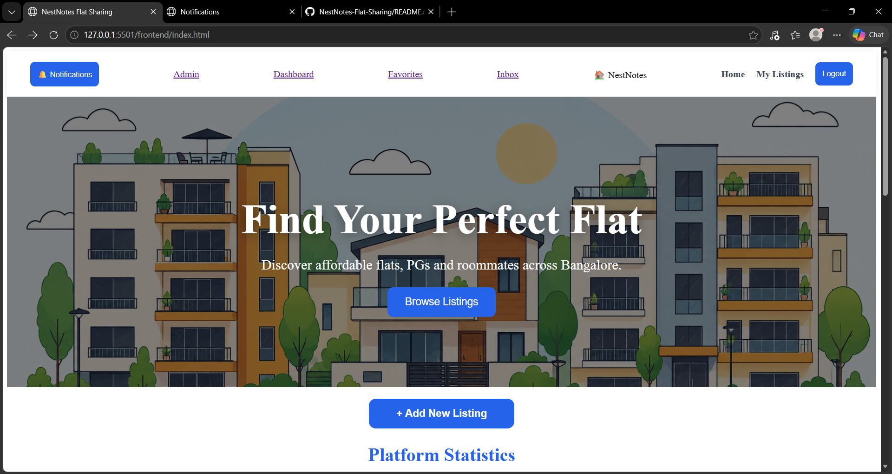
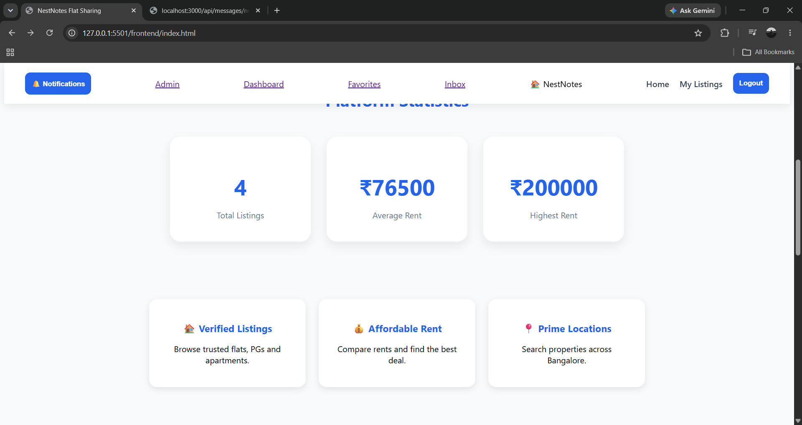
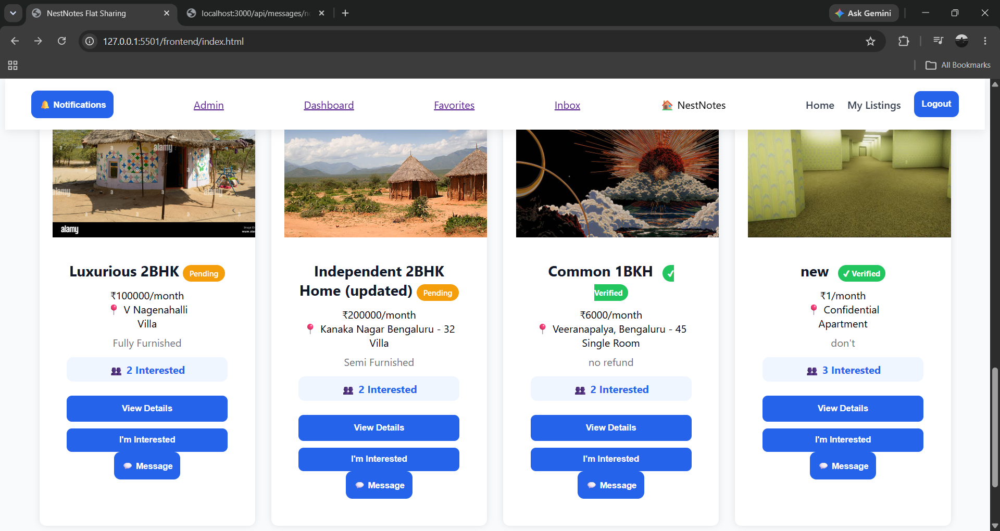
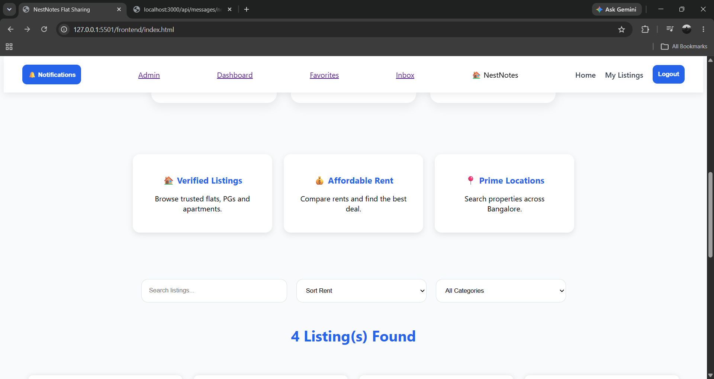

## Dashboard
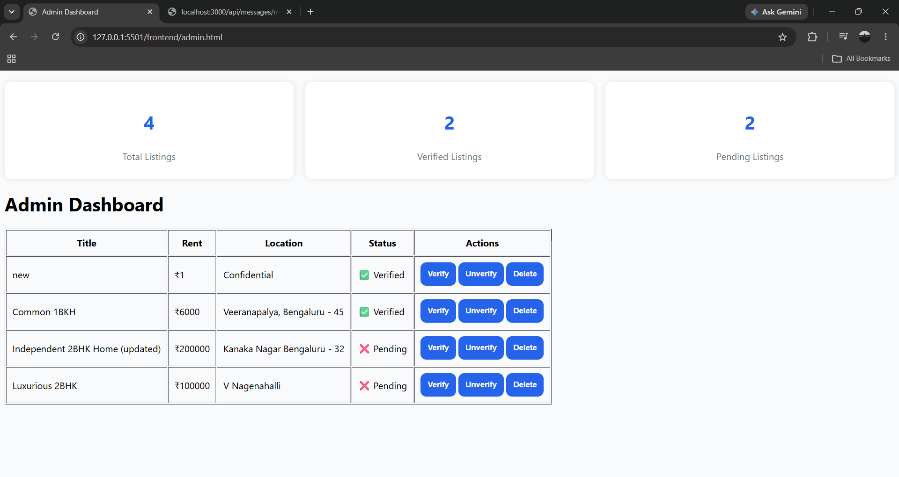
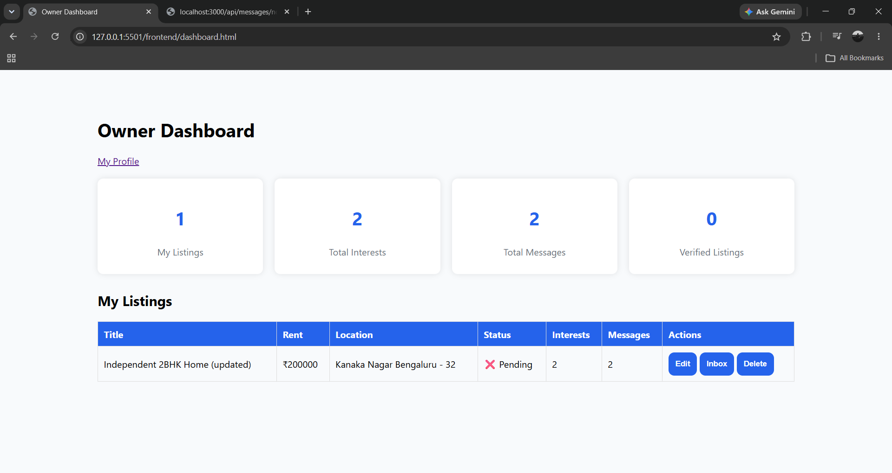

## Login Page
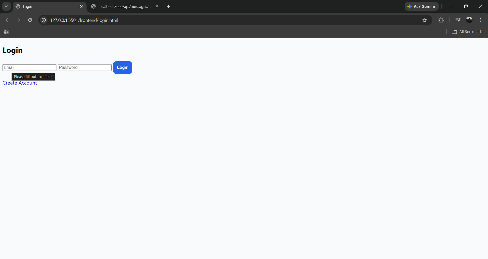

## Notifications (under development)
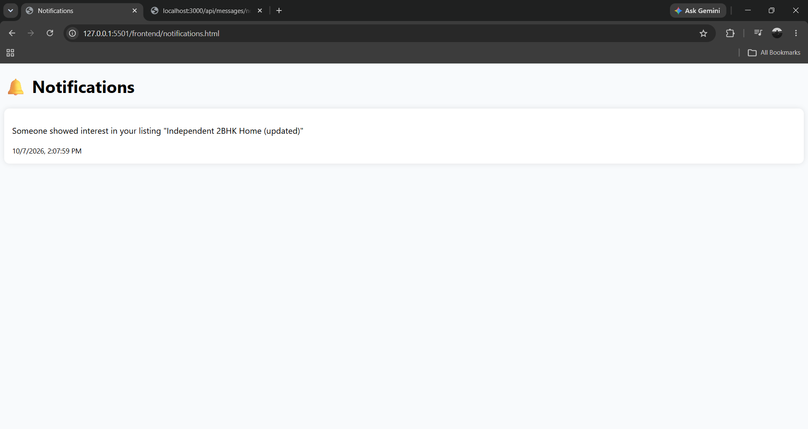

## Inbox and Chat
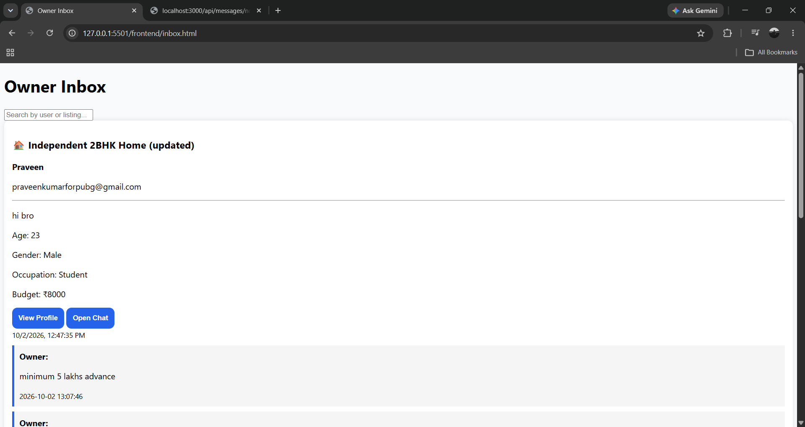
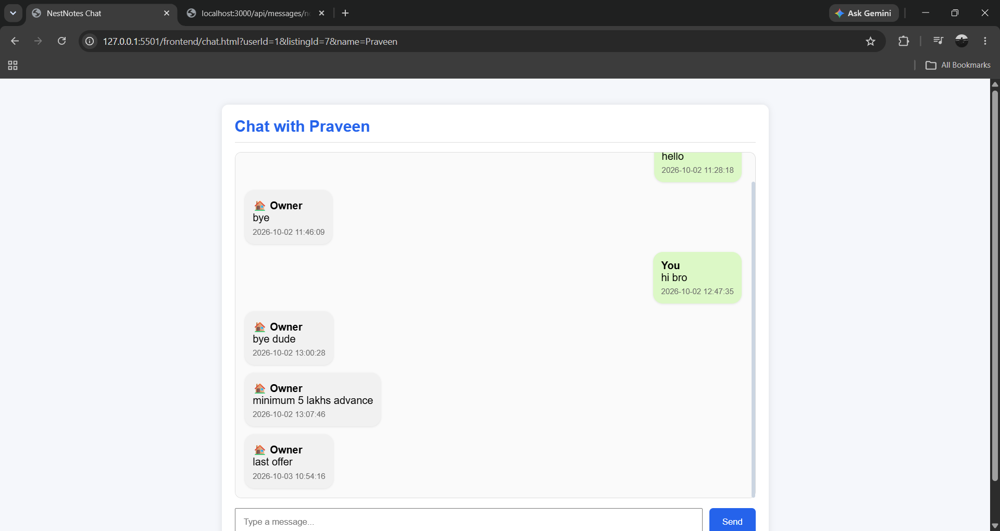

## User Listings
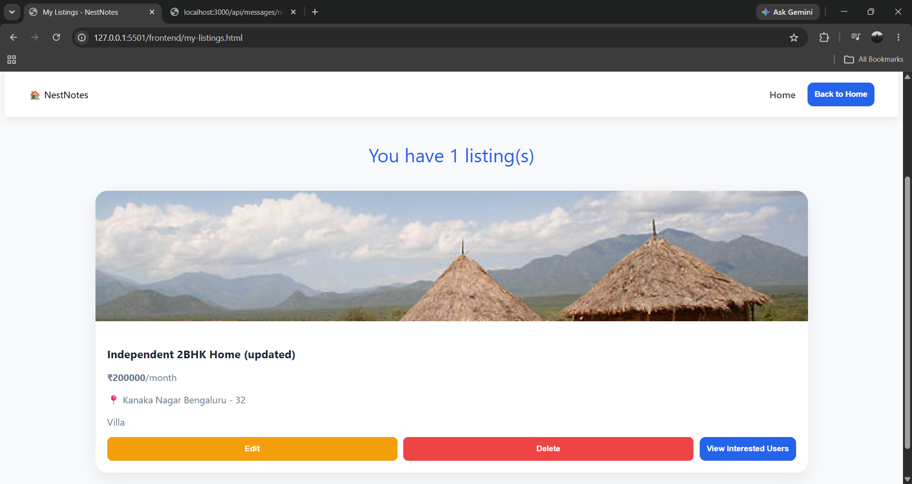

## Future Improvements (v1.1)

- Notification System Improvements
- Better Mobile UI
- Real-Time Chat
- Email Notifications
- Advanced Search Filters
- Maps Integration
- Cloud Image Storage

## Author

Praveen Kumar

BCA Student | Full Stack Development Intern

## License

Educational / Portfolio Project